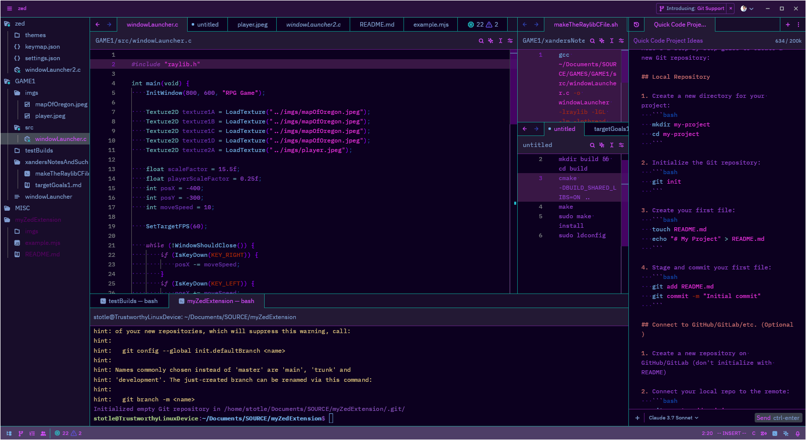
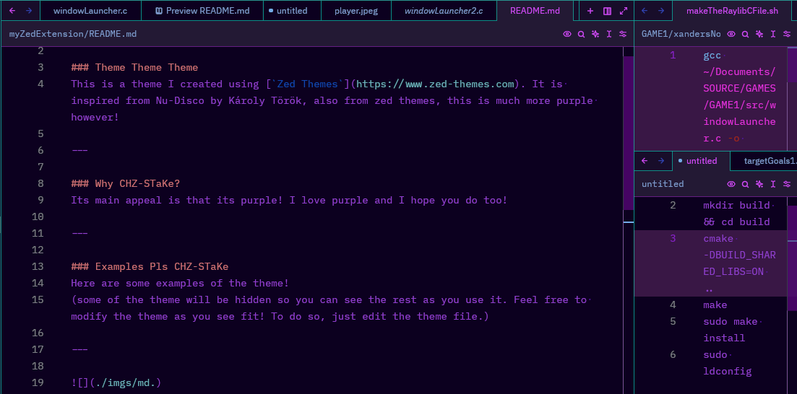
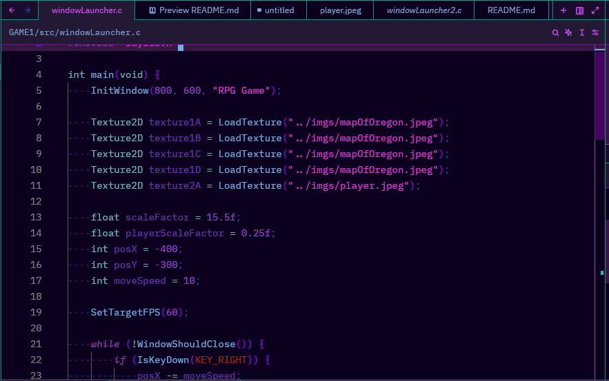
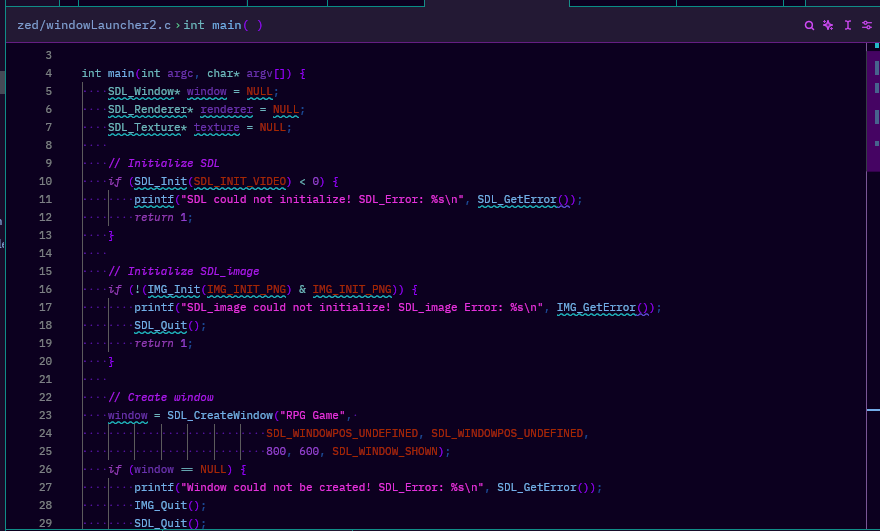
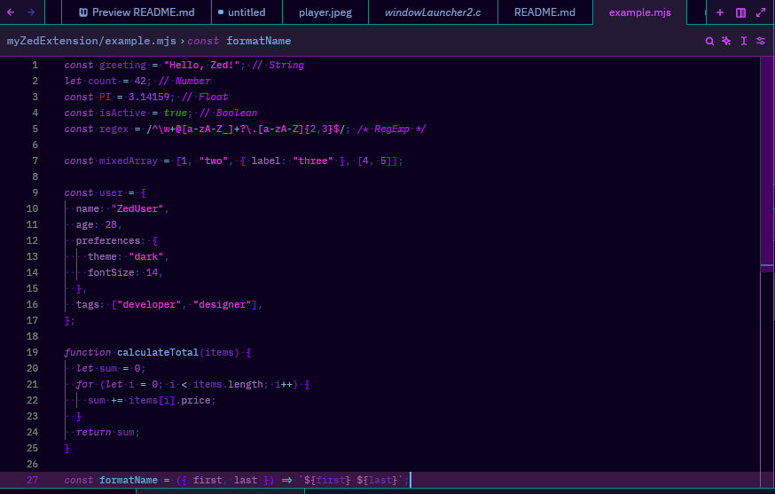
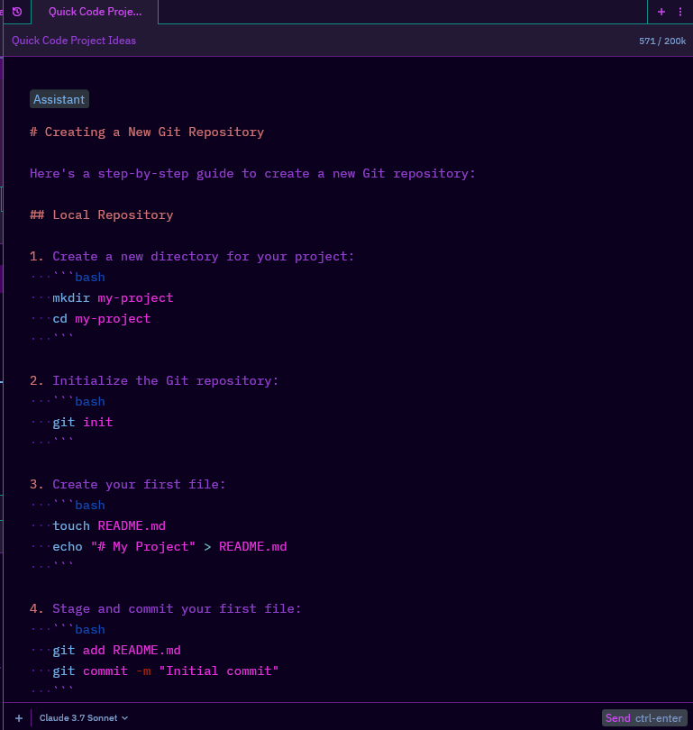

# CHZ-STaKes Theme! - Its purple!

The Name Of The Theme/extension should be `Dancin Wit A Purple CHZ-ST-aKe` ( [CHZ-_-STaKe/CHZ-_-ST-aKe] if underscores are allowed)

### Theme Theme Theme
This is a theme I created using [`Zed Themes`](https://www.zed-themes.com). It is inspired from Nu-Disco by Károly Török, also from zed themes, this is much more purple however!

---

### Why CHZ-STaKe?
Its main appeal is that its purple! I love purple and I hope you do too!

---

### Examples Pls CHZ-STaKe
Here are some examples of the theme!
(some of the theme will be hidden so you can see the rest as you use it. Feel free to modify the theme as you see fit! To do so, just edit the theme file.)

#### Fullscreen:

Fullscreen

---

#### Markdown:

Markdown

---

#### C:

C

---

#### Errors:

Errors

---

#### JavaScript:

JavaScript

---

#### AI:

AI

---
